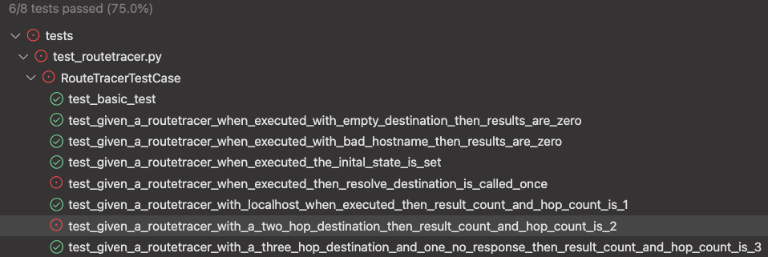

# Route Tracer
Today in TDD, the focus is on building an application using test doubles. This application will provide basic information on how network traffic travels from the local computer to a destination on the internet. This exercise aims to demonstrate a technique that makes  Test Driven Development easier when approaching an algorithm heavily dependent on infrastructure.

Simplify TDD by avoiding infrastructure and framework dependenies in your test environment. Dependencies can slow your tests down or maynot be available. The practice of writing developer tests has techniques that allow us to focus on testing the code we are writing. Gain better control and visibility for the subject under test using Test Doubles. Test doubles allow us to create a fake representation of an object or function for testing purposes.

Fake it until you make it.

Several types of [test doubles](http://xunitpatterns.com/Test%20Double.html) are outlined in Gerard Mezeros' book "XUnit Test Patterns: Refactoring Test Code"  

* [Test Stub](http://xunitpatterns.com/Test%20Stub.html): Replace actual functionality with a test-specific object that supports the indirect inputs of the subject under test
* [Test Spy](http://xunitpatterns.com/Test%20Spy.html): Similar to the test stub but contains recording capability to be verified by a test
* [Test Mock](http://xunitpatterns.com/Mock%20Object.html): Imitate the behavior of objects to verify logic independently of other components or dependencies.
* [Test Fake](http://xunitpatterns.com/Fake%20Object.html): A lightweight replacement a component dependency of the subject under test.
* [Test Dummy](http://xunitpatterns.com/Dummy%20Object.html): Object without implementation to satisfy a method signature on the subject under test

This tutorial will heavily rely on test doubles as a way to test drive the application. Different languages provide toolkits that provide developers easy access to test doubles. This example will use Python's MagicMock toolkit that is part of the standard unittest module.

## The Requirements

  > *As a user, I would like a routetracer to display routes and transit delays to a fqdn destination across the internet*
   
  >*Given a routetracer*
  >
  >>*When the destination is localhost*
  >
  >>*Then the result list should include one hop result 172.0.0.1 and request time in milliseconds*

  > *Given a routetracker*
  >
  >>*When the destination is two hops away*
  >
  >>*Then the result list should include the address of the first hop and reqest time in milliseconds*
  >
  >>>*And the address of the second hop and time in milliseconds*

  >*Given a routtracer*
  >
  >>*When the destination is multiple hops away and the a hop does not respond*
  >
  >>*Then the fist result contains address and request time in milliseconds*
  >
  >>>*And the second result contains a * *
  >
  >>>*And the third result contains the address and request time in milliseconds*

## The Context
  If you are new to socket programming and the protocols that bind us, please read [Indroduction to Sockets Programming in C using TCP/IP](https://www.csd.uoc.gr/~hy556/material/tutorials/cs556-3rd-tutorial.pdf)

## The Plan
  Spending time with pencil and paper to create a plan will improve your TDD experience. 

  

## The Setup
  Validate Python 3.x is installed
  ```bash
  $ python -V
  Python 3.10.2
  ```
  ```bash
  mkdir -p tdd_project/tests tdd_project/network
  cd tdd_project
  echo "#module" >>  network/__init__.py
  echo "#" >> network/RouteTrace.py
  echo "#module" >>  tests/__init__.py
  echo "#" >> tests/test_routetracer.py
  echo "#main" >> main.py
  ```

Validate unit test execution with a simple test
   ```python
   import unittest

   class RouteTracerTestCase(unittest.TestCase):

      def test_basic_test(self):
        self.assertTrue(True)
   ```
Run the test. Setup is complete if you see the following:
  ```bash
  $ python -m unittest
  .
  ----------------------------------------------------------------------
  Ran 1 test in 0.000s

  OK
  ```

## Steps
1. Write the simplest failing test we can think of. Update tests/test_routetracer.py and create a test that will not compile. 
   ```python
   import unittest
     
   class RouteTracerTestCase(unittest.TestCase):

      def test_basic_test(self):
         self.assertTrue(True)
       
      def test_given_a_routetracer_when_executed_without_a_destination_then_results_are_zero(self):
         sut = RouteTracer()
         sut.execute()
         self.assertEqual(len(sut.results()), 0)
   ```
   Run the unit tests to show the failing state
   ```bash
   $ python -m unittest
   ...
   NameError: name 'RouteTracer' is not defined

   ----------------------------------------------------------------------
   Ran 2 tests in 0.000s

   FAILED (errors=1)
   ```

   The test is failing because the RouteTracer object has not been defined. 

2. Write the minimal amount of code to get the test to pass. Add the following to network/RouteTrace.py and write production code to make the test pass:

   ```python
   class RouteTracer(object):
       def __init__(self) -> None:
           pass

       def execute(self):
           pass

       def results(self):
           return []
   ```
   Make sure this new class is imported in tests/test_routetracer.py
   ```python
   import unittest
   from network.RouteTrace import RouteTracer


   class RouteTracerTestCase(unittest.TestCase):
      def test_basic_test(self):
         self.assertTrue(True)
       
      def test_given_a_routetracer_when_executed_without_a_destination_then_results_are_zero(self):
         sut = RouteTracer()
         sut.execute()
         self.assertEqual(len(sut.results()), 0)
   ```
3. Re-run the tests and you should see a green state
   ```bash
   python -m unittest
   ...

   Ran 2 tests in 0.000s
   OK
   ```
4. Continue the pattern off adding the next simplest test. The RouteTracer will need a destination has an input. Write a test to include an empty string as a parameter.

   ```python
   import unittest
   from network.RouteTrace import RouteTracer


   class RouteTracerTestCase(unittest.TestCase):
      def test_basic_test(self):
         self.assertTrue(True)
       
      def test_given_a_routetracer_when_executed_without_a_destination_then_results_are_zero(self):
         sut = RouteTracer()
         sut.execute()
         self.assertEqual(len(sut.results()), 0)

      def test_given_a_routetracer_when_executed_with_empty_destination_then_results_are_zero(self):
         sut = RouteTracer("")
         sut.execute()
         self.assertEqual(len(sut.results()), 0)
   ```
   Running our test results in an error.
   ```bash
   $ python -m unittest
   ...
   TypeError: __init__() takes 1 positional argument but 2 were given

   ----------------------------------------------------------------------
   Ran 3 tests in 0.000s

   FAILED (errors=1)
   ```
5. Add the constructor parameter for the destination to make the test pass
   ```python
   class RouteTracer(object):
       def __init__(self, destination) -> None:
           self.destination = destination
           pass

       def execute(self):
           pass

       def results(self):
           return []
   ```

   The new test passes, and the first test is failing.

      

   ```bash
   $ python -m unittest
      ...
      TypeError: __init__() missing 1 required positional argument: 'destination'

      ----------------------------------------------------------------------
      Ran 3 tests in 0.000s

      FAILED (errors=1)
   ```

   A destination isn't an optional parameter. Deleting the first test is a quick way to a green state.

   ```python
   class RouteTracerTestCase(unittest.TestCase):
      def test_basic_test(self):
         self.assertTrue(True)

      def test_given_a_routetracer_when_executed_with_empty_destination_then_results_are_zero(self):
         sut = RouteTracer("")
         sut.execute()
         self.assertEqual(len(sut.results()), 0)
   ```
   

   All green, all good


6. Add another test that includes a [FQDN](https://en.wikipedia.org/wiki/Fully_qualified_domain_name) and verify the tests still pass

   ```python
   def test_given_a_routetracer_when_executed_with_google_hostname_then_results_are_zero(self):
           sut = RouteTracer("google.com")
           sut.execute()
           self.assertEqual(len(sut.results()), 0)
   ```
   

7. The first step in our plan is to create an initial state. The requirements note there will be addresses recieved, a destination address and an accumulation of 'hops'. 

   ```python
   def test_given_a_routetracer_when_executed_the_inital_state_is_set(self):
           sut = RouteTracer("google.com")
           self.assertEqual(sut.hop_count, 0)
           self.assertEqual(sut.received_address, "")
           self.assertEqual(sut.results(), [])
   ```
   ```
   $ python -m unittest
   ...
   AttributeError: 'RouteTracer' object has no attribute 'hop_count'

   ----------------------------------------------------------------------
   Ran 4 tests in 0.000s

   FAILED (errors=1)
   ```
   

   ```python
   class RouteTracer(object):
       def __init__(self, destination):
           self.destination = destination
           self._initial_state()
           pass

       def execute(self):
           pass

       def results(self):
           return self.route

       def _initial_state(self):
           self.hop_count = 0
           self.received_address = ""
           self.route = []
   ```
   ```
   $ python -m unittest            
   ....
   ----------------------------------------------------------------------
   Ran 4 tests in 0.000s

   OK
   ```
8. The second step in our plan is to resolve the provided hostname to an IP address. The infrastructure for resolving a domain to ip address does not exist. TDD encourages us to fake it until you make it with Mocks. Import the mocking library to the test file. 
    

   ```python
   from unittest.mock import MagicMock
   ```

   ```python
   def test_given_a_routetracer_when_executed_then_resolve_destination_is_called_once(self):
           sut = RouteTracer("google.com")
           sut._resolve_destination = MagicMock(return_value="142.250.190.78")
           sut.execute()
           sut._resolve_destination.assert_called_once()

   ```
   ```bash
   $ python -m unittest
   ...
   AssertionError: Expected 'mock' to have been called once. Called 0 times.
   ----------------------------------------------------------------------
   Ran 4 tests in 0.001s

   FAILED (failures=1)
   ```
   The test fails because the _resolve_destination() method has not been called. Adding this invocation in the RouteTracer class will put us back into a green state

   ```python
   class RouteTracer(object):
      def __init__(self, destination):
         self.destination = destination
         self._initial_state()

      def execute(self):
         address = self._resolve_destination()

      def _resolve_destination(self):
         pass

      def results(self):
         return self.route

      def _initial_state(self):
         self.hop_count = 0
         self.received_address = ""
         self.route = []
   ```

   ```
   $ python -m unittest
   ...
   ----------------------------------------------------------------------
   Ran 5 tests in 0.000s

   OK
   ```
   


9. Build on the algoritm by writing a simple test case for the localhost senario.

   > *As a user, I would like a routetracer to display routes and transit delays to a fqdn destination across the internet*
      
     >*Given a routetracer*
     >
     >>*When the destination is localhost*
     >
     >>*Then the result list should include one hop result 172.0.0.1 and request time in milliseconds*

   ```python
   def test_given_a_routetracer_with_localhost_when_executed_then_result_count_and_hop_count_is_1(self):
           sut = RouteTracer("localhost")
           sut._resolve_destination = MagicMock(return_value="127.0.0.1")
           sut._get_next_hop = MagicMock(return_value="127.0.0.1")
           sut.execute()
           self.assertEqual(len(sut.results()), 1)
           self.assertEqual(sut.hop_count, 1)
           self.assertEqual(sut.results()[0]["address"], "127.0.0.1")
   ```
   

   ```python
   class RouteTracer(object):
       def __init__(self, destination) -> None:
           self.destination = destination
           self._initial_state()

       def execute(self):
           self.destination_address = self._resolve_destination()
           sender = self._create_sender()
           receiver = self._create_receiver()
           self.hop_count += 1
           self.route.append({"address": self.destination_address})

       def _resolve_destination(self):
           pass

       def _create_sender(self):
           pass

       def _create_receiver(self):
           pass

       def _get_next_hop(self):
           pass

       def results(self):
           return self.route

       def _initial_state(self):
           self.hop_count = 0
           self.received_address = ""
           self.route = []
   ```
   Writing the minimal amount of code to get this test to pass broke our other tests

   

11. Finish the alogrithm and refactor tests to get back to the green state. 

    ```python
    class RouteTracer(object):
        def __init__(self, destination):
            self.destination = destination
            self._initial_state()

        def execute(self):
            self.destination_address = self._resolve_destination()

            while self.destination_address != self.received_address:
                sender = self._create_sender()
                receiver = self._create_receiver()
                self.hop_count += 1
                self.received_address = self._get_next_hop()
                self.route.append({"address": self.received_address})

        def _resolve_destination(self):
            pass

        def _create_sender(self):
            pass

        def _create_receiver(self):
            pass

        def _get_next_hop(self):
            pass

        def results(self):
            return self.route

        def _initial_state(self):
            self.hop_count = 0
            self.received_address = ""
            self.route = []
    ```

    ```python
    import unittest
    from network.RouteTrace import RouteTracer
    from unittest.mock import MagicMock


    class RouteTracerTestCase(unittest.TestCase):
        def test_basic_test(self):
            self.assertTrue(True)

        def test_given_a_routetracer_when_executed_with_empty_destination_then_results_are_zero(self):
            sut = RouteTracer("")
            sut._resolve_destination = MagicMock(return_value="")
            sut.execute()
            self.assertEqual(len(sut.results()), 0)

        def test_given_a_routetracer_when_executed_with_bad_hostname_then_results_are_zero(self):
            sut = RouteTracer("bad_example.com")
            sut._resolve_destination = MagicMock(return_value="")
            sut.execute()
            self.assertEqual(len(sut.results()), 0)

        def test_given_a_routetracer_when_executed_the_inital_state_is_set(self):
            sut = RouteTracer("google.com")
            self.assertEqual(sut.hop_count, 0)
            self.assertEqual(sut.received_address, "")
            self.assertEqual(sut.results(), [])

        def test_given_a_routetracer_when_executed_then_resolve_destination_is_called_once(self):
            sut = RouteTracer("google.com")
            sut._get_next_hop = MagicMock(return_value="142.250.190.78")
            sut._resolve_destination = MagicMock(return_value="142.250.190.78")
            sut.execute()
            sut._resolve_destination.assert_called_once()

        def test_given_a_routetracer_with_localhost_when_executed_then_result_count_and_hop_count_is_1(self):
            sut = RouteTracer("localhost")
            sut._resolve_destination = MagicMock(return_value="127.0.0.1")
            sut._create_sender = MagicMock()
            sut._create_receiver = MagicMock()
            sut._get_next_hop = MagicMock(return_value="127.0.0.1")
            sut.execute()
            sut._create_sender.assert_called_once()
            sut._create_receiver.assert_called_once()
            self.assertEqual(len(sut.results()), 1)
            self.assertEqual(sut.hop_count, 1)
            self.assertEqual(sut.results()[0]["address"], "127.0.0.1")
    ```
    


12. Write a test case that mocks a two hop scenario
    > *As a user, I would like a routetracer to display routes and transit delays to a fqdn destination across the internet*
         
      > *Given a routetracker*
      >
      >>*When the destination is two hops away*
      >
      >>*Then the result list should include the address of the first hop and reqest time in milliseconds*
      >
      >>>*And the address of the second hop and time in milliseconds*

    ```python
    def test_given_a_routetracer_with_a_two_hop_destination_then_result_count_and_hop_count_is_2(self):
            sut = RouteTracer("twohops.com")
            sut._resolve_destination = MagicMock(return_value="127.0.0.2")
            sut._get_next_hop = MagicMock(side_effect=["127.0.0.1", "127.0.0.2"])
            sut.execute()
            print(sut.results())
            self.assertEqual(len(sut.results()), 2)
            self.assertEqual(sut.results()[0]["address"], "127.0.0.1")
            self.assertEqual(sut.results()[1]["address"], "127.0.0.2")
    ```

    All green, all good

    ```bash
    $ python -m unittest
    ...
    ----------------------------------------------------------------------
    Ran 7 tests in 0.002s

    OK
    ```

    

13. Further enhancements are required to meet the Acceptance Criteria. Mock out the time calculation and update the code to make the test pass.

```python
def test_given_a_routetracer_with_localhost_when_executed_then_result_count_and_hop_count_is_1(self):
    sut = RouteTracer("localhost")
    sut._resolve_destination = MagicMock(return_value="127.0.0.1")
    sut._create_sender = MagicMock()
    sut._create_receiver = MagicMock()
    sut._get_next_hop = MagicMock(return_value="127.0.0.1")
    sut._get_start_time = MagicMock(return_value=3)
    sut._get_end_time = MagicMock(return_value=1)
    sut._get_request_time = MagicMock(return_value=4)
    sut.execute()
    sut._create_sender.assert_called_once()
    sut._create_receiver.assert_called_once()
    sut._get_start_time.assert_called()
    sut._get_end_time.assert_called()
    sut._get_request_time.assert_called()
    self.assertEqual(len(sut.results()), 1)
    self.assertEqual(sut.hop_count, 1)
    self.assertEqual(sut.results()[0]["address"], "127.0.0.1")
    self.assertEqual(sut.results()[0]["time"], 4)
```

```python
class RouteTracer(object):
    def __init__(self, destination) -> None:
        self.destination = destination
        self._initial_state()

    def execute(self):
        self.destination_address = self._resolve_destination()

        while self.destination_address != self.received_address:
            sender = self._create_sender()
            receiver = self._create_receiver()
            self.hop_count += 1
            start_time = self._get_start_time()
            self.received_address = self._get_next_hop()
            end_time = self._get_end_time()
            request_time = self._get_request_time(start_time, end_time)
            self.route.append({"address": self.received_address, "time": request_time})

    def _resolve_destination(self):
        pass

    def _create_sender(self):
        pass

    def _create_receiver(self):
        pass

    def _get_next_hop(self):
        pass

    def _get_start_time(self):
        pass

    def _get_end_time(self):
        pass

    def _get_request_time(self, start_time, end_time):
        pass

    def results(self):
        return self.route

    def _initial_state(self):
        self.hop_count = 0
        self.received_address = ""
        self.route = []
```


13. Further enhancements are required to meet the Acceptance Criteria. Mock out the * response if a hop request times out.

    ```python
    def test_given_a_routetracer_with_a_three_hop_destination_and_one_no_response_then_result_count_and_hop_count_is_3(self):
        sut = RouteTracer("twohops.com")
        sut._resolve_destination = MagicMock(return_value="127.0.0.3")
        sut._get_next_hop = MagicMock(side_effect=["127.0.0.1", "", "127.0.0.3"])
        sut._create_sender = MagicMock()
        sut._create_receiver = MagicMock()
        sut.execute()
        results = sut.results()
        self.assertEqual(results[0]["address"], "127.0.0.1")
        self.assertEqual(results[1]["address"], "*")
        self.assertEqual(results[2]["address"], "127.0.0.3")
        self.assertEqual(sut.hop_count, 3)
    ```
    Update the execute method to get this test to pass
    ```python
    def execute(self):
        self.destination_address = self._resolve_destination()

        while self.destination_address != self.received_address:
            sender = self._create_sender()
            receiver = self._create_receiver()
            self.hop_count += 1
            start_time = self._get_start_time()
            self.received_address = self._get_next_hop()
            end_time = self._get_end_time()
            request_time = self._get_request_time(start_time, end_time)

            if not self.received_address:
                self.received_address = "*"
                request_time = 0

            self.route.append({"address": self.received_address, "time": request_time})
    ```

    

    The tests address the user story and the acceptance criteria. Barring a test suite refactor, we have an alogrithm we trust. 

15. The tests show we have addressed the Acceptance Criteria. The tests are faking it, now it's time to make it. Update the empty methods with infrastructure code that will make this a working application.
    ```python
    import socket
    import datetime

    class RouteTracer(object):
        def __init__(self, destination) -> None:
            self.destination = destination
            self._initial_state()
            self.port = 33444

        def execute(self):
            self.destination_address = self._resolve_destination()

            while self.destination_address != self.received_address:
                sender = self._create_sender()
                receiver = self._create_receiver()
                self.hop_count += 1
                start_time = self._get_start_time()
                self.received_address = self._get_next_hop(sender, receiver)
                end_time = self._get_end_time()
                request_time = self._get_request_time(start_time, end_time)

                if not self.received_address:
                    self.received_address = "*"
                    request_time = 0

                self.route.append({"address": self.received_address, "time": request_time})

        def _resolve_destination(self):
            address = ""
            try:
                address = socket.gethostbyname(self.destination)
            except socket.error as e:
                raise IOError("Can not resolve {}: {}", self.destination, e)

            return address

        def _create_sender(self):
            temp_socket = socket.socket(
                family=socket.AF_INET, type=socket.SOCK_DGRAM, proto=socket.IPPROTO_UDP
            )
            temp_socket.setsockopt(socket.SOL_SOCKET, socket.SO_REUSEADDR, 1)
            temp_socket.setsockopt(socket.IPPROTO_IP, socket.IP_TTL, self.hop_count)

            return temp_socket

        def _create_receiver(self):
            temp_socket = socket.socket(
                family=socket.AF_INET, type=socket.SOCK_RAW, proto=socket.IPPROTO_ICMP
            )

            temp_socket.settimeout(3.0)

            try:
                temp_socket.bind(("", self.port))
            except socket.error as e:
                raise IOError("bind receiver error: {}".format(e))

            return temp_socket

        def _get_next_hop(self, sender, receiver):
            sender.sendto(b"", (self.destination_address, self.port))
            temp_response = ""

            try:
                _, temp_response = receiver.recvfrom(1024)
            except socket.error as e:
                return ""
            finally:
                receiver.close()
                sender.close()
            return temp_response[0]

        def _get_start_time(self):
            return self._get_time()

        def _get_end_time(self):
            return self._get_time()

        def _get_request_time(self, start_time, end_time):
            return (end_time - start_time).total_seconds() * 1000

        def _get_time(self):
            return datetime.datetime.now()

        def results(self):
            return self.route

        def _initial_state(self):
            self.hop_count = 0
            self.received_address = ""
            self.route = []

    ```
    This change broke a couple of unit tests. 
    

    Fake _create_sender and _create_receiver to fix the failing tests.

    ```python
    def test_given_a_routetracer_when_executed_then_resolve_destination_is_called_once(self):
        sut = RouteTracer("google.com")
        sut._get_next_hop = MagicMock(return_value="142.250.190.78")
        sut._resolve_destination = MagicMock(return_value="142.250.190.78")
        sut._create_sender = MagicMock()
        sut._create_receiver = MagicMock()
        sut.execute()
        sut._resolve_destination.assert_called_once()
    ```
    ```python
    def test_given_a_routetracer_with_a_two_hop_destination_then_result_count_and_hop_count_is_2(self):
        sut = RouteTracer("twohops.com")
        sut._resolve_destination = MagicMock(return_value="127.0.0.2")
        sut._get_next_hop = MagicMock(side_effect=["127.0.0.1", "127.0.0.2"])
        sut._create_sender = MagicMock()
        sut._create_receiver = MagicMock()
        sut.execute()
        print(sut.results())
        self.assertEqual(len(sut.results()), 2)
        self.assertEqual(sut.results()[0]["address"], "127.0.0.1")
        self.assertEqual(sut.results()[1]["address"], "127.0.0.2")
    ```
    


16. Update ./main.py to see the route tracer in action
    ```python
    import getopt
    import sys
    from network.RouteTrace import RouteTracer

    options, remainder = getopt.getopt(
        sys.argv[1:],
        "d:",
        [
            "destination=",
        ],
    )


    def main(destination):
        rt = RouteTracer(destination)
        rt.execute()
        results = rt.results()

        for hop in range(len(results)):
            print(
                "{}. {} {}ms".format(
                    hop + 1, results[hop]["address"], str(results[hop]["time"])
                )
            )


    if __name__ == "__main__":
        destination = ""
        for opt, arg in options:
            if opt in ("-d", "--destination"):
                destination = arg

        main(destination)

    ```
    Run the application, note it will take several seconds to print the output.
    ```bash
    $ sudo python main.py -d localhost 
    1. 127.0.0.1 0.115ms
    ```
    ```
    $ sudo python main.py -d google.com
    1. 192.168.1.1 3.872ms
    2. 192.168.1.1 3.643ms
    3. * 0ms
    4. * 0ms
    5. * 0ms
    6. * 0ms
    7. 23.255.224.120 16.274ms
    8. 23.255.224.107 16.319ms
    9. * 0ms
    10. 142.251.60.6 17.226000000000003ms
    11. 108.170.244.2 16.418ms
    12. 209.85.251.241 16.041ms
    13. 142.251.32.14 16.217ms
    ```

This should have been a video...